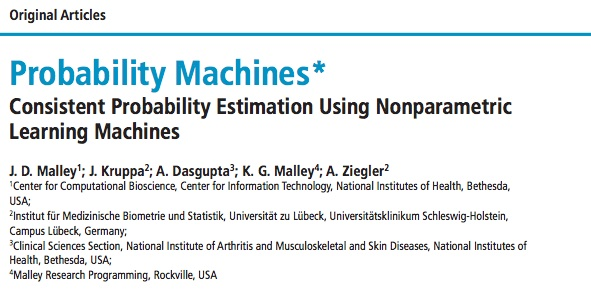
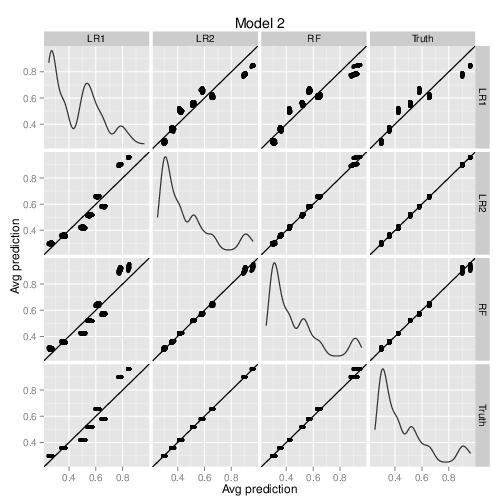
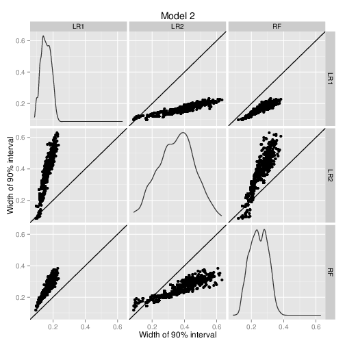
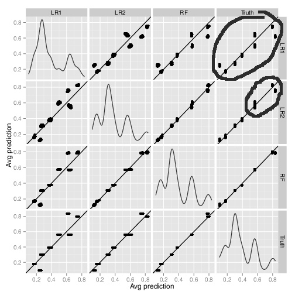

## Binary regression

We're already familiar with binary regression in one form
<p style="font-size:30px;text-align:center;color:red">logistic regression</p>

---

## Binary regression

We're already familiar with binary regression in one form
<p style="font-size:30px;text-align:center;color:red">logistic regression</p>
In fact, if you recall, we write
$$ \log(\frac{p}{1-p}) = \beta_0+\beta_1X_1+\beta_2X_2 $$

---

## Binary regression

We're already familiar with binary regression in one form
<p style="font-size:30px;text-align:center;color:red">logistic regression</p>
In fact, if you recall, we write
$$ \log(\frac{p}{1-p}) = \beta_0+\beta_1X_1+\beta_2X_2 $$

We then promptly dichotomize our predictions into 0-1 and look at misclassification rates

---

## Binary regression

We're already familiar with binary regression in one form
<p style="font-size:30px;text-align:center;color:red">logistic regression</p>
In fact, if you recall, we write
$$ \log(\frac{p}{1-p}) = \beta_0+\beta_1X_1+\beta_2X_2 $$

We then promptly dichotomize our predictions into 0-1 and look at misclassification rates

<p style="font-size:100px;text-align:center">WHY!!!</p>


--- .segue .dark

## Probability machines

---

## Probability machines

Probability machines are learning machines for binary outcomes which are 

+ non-parametric
+ consistent



---

## Probability machines

Probability machines are learning machines for binary outcomes which are 

+ non-parametric
+ consistent

Several candiates exist for probability machines

+ Random Forests regression
+ k-nearest neighbors regression
+ Some support vector machines
+ Potentially many others


---

## Probability machines

Probability machines are learning machines for binary outcomes which are 

+ non-parametric
+ consistent

Several candiates exist for probability machines

+ <span style="color:blue">**Random Forests regression (RFPM)**</span>
+ k-nearest neighbors regression
+ Some support vector machines
+ Potentially many others

Biau and colleagues proved several consistency results for both RF and kNN 

--- 

## Probability machines

A PM has several advantages over classical regression methods

> + There is no need to assume a particular data generating model
> + There is no need to specify a functional form for the relationship between the outcome and predictors

>   + Interactions
>   + Transformations of variables
>   + Link functions (logit, probit, tobit, ...)

> + There is no restriction on dimensionality of the predictors
> + Algorithms are often parallelizable 

--- &twocol

## Probability machines

Let's compare probability machines to logistic regression, the industry standard

  Logistic regression                   | Probability machines
  ------------------------------------- | -----------------------------
  Assumes data from logistic regression | No such assumption
  Explicit functional form              | No such specification
  Need to specify interactions          | Interactions implicit
  Predictors less than observations     | Scalable to higher dimensions
  
<br>
Some will argue that logistic regression is important to understand the 
<span style="color:black;font-weight:bold;text-decoration:underline">effect</span> of predictors. 

We'll address this in the next hour. For now, let's look at prediction

--- .segue .dark

## Predictive ability

---

## Simulations

We generate data from a *logistic regression* model with 

+ 10 independent binary features
+ 3 features associated with outcome to various degrees
+ 7 features not associated with outcome (to mimic sparseness)

---

## Simulations

We fit three models to the generated data

+ Main effects logistic regression <br>
``` glm(y~x1+x2+x3+..., family=binomial) ```

+ Main effects + two-way interactions logistic regression <br>
``` glm(y~(x1+x2+x3+...)^2, family=binomial) ```

+ Random forest regression <br>
``` randomForest(y~x1+x2+x3+...) ```

For this entire exercise, <span style="font-weight:bold">we do not change this code</span>

---

## Simulations

Start with data from a main effects model (ORs of 1.2, 1.7, 2.5)


<p style="clear:both;"></p>

LR1 = main effects logistic regression<br>
LR2 = main effects+interaction logistic regression<br>
RF = random forest probability machine

---

## Simulations

Now add interactions (X1 x X2 = 2, X2 x X3 = 5)



<p style="clear:both;"></p>

LR1 = main effects logistic regression<br>
LR2 = main effects+interaction logistic regression<br>
RF = random forest probability machine

---

## Simulations

Now add interactions (X1 x X2 = 2, X2 x X3 = 5)


<p style="clear:both;"></p>

LR1 = main effects logistic regression<br>
LR2 = main effects+interaction logistic regression<br>
RF = random forest probability machine

---

## Simulation

Now let's look at arbitrary probabilities for each (X1,X2,X3) combination


<p style="clear:both;"></p>

---

## Simulation

Now let's look at arbitrary probabilities for each (X1,X2,X3) combination



<p style="clear:both;"></p>

--- .segue .dark

## The bottom line

---

## Conclusions

> 1. If the logistic model is mis-specified, it does poorly. **RFPM doesn't**
> 2. We don't have to change the code for RFPM to do well for different generating models
> 3. RFPM captures different aspects of the data auto-magically. With logistic regression, if you're not correct in your specification, you can screw up.
> 4. Main effects data is rather rare, but we fit main effects logistic regression as the default. Fit RFPM instead, CYA, and (preview) see what kinds of models might be reasonable 

--- bg:url(figure/img_6940.jpg)

<h3 style="color:yellow">Can we NOT use logistic regression to get effect sizes?</h3>

